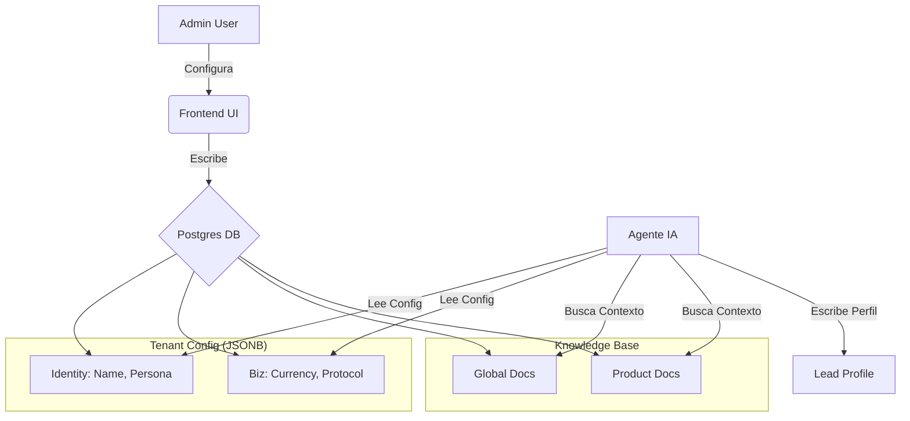

# Plan de UX para Onboarding de Tenants y Diccionario de Datos (End-to-End)

Este documento detalla la estrategia completa para gestionar los datos de los agentes Multi-Tenant desde el Frontend, asegurando que no existan "lagunas" de información y que la experiencia de usuario sea intuitiva.

## 1. Principios de Diseño UX
1.  **Integración Orgánica:** No crear "Wizards" externos. Los campos nuevos deben vivir donde el usuario espera encontrarlos lógicamente.
2.  **Zero-Gap:** Cada campo requerido por el agente debe tener su contraparte en la UI.
3.  **Separación de Conocimiento:** Distinción clara entre conocimiento de Marca (Global) y de Producto (Offer).

---

## 2. Inventario de Campos y Mapeo UX

### Nivel 1: Identidad del Tenant (Configuración Global)
Configura "quién" es el agente. Estos datos definen la personalidad base.

**Ubicación UI:** Panel Admin > Sección "Tenants" > Editar Tenant > **Pestaña "Identidad del Agente"** (Nueva o renombrada).

| Campo DB (`config_json`) | Tipo UI | Obligatorio | Default | Descripción / Placeholder | Consumo Agente |
| :--- | :--- | :--- | :--- | :--- | :--- |
| `company_name` | Input Text | Sí | (Nombre Tenant) | "Visionarias" | Reemplaza `{{ company_name }}` en prompts. |
| `agent_persona` | Input Text | Sí | "Asistente" | "Visionaria" | Nombre propio del bot. Define `{{ agent_persona }}`. |
| `agent_role` | Input Text | Sí | "Asistente Virtual" | "Experta en ventas B2B" | Define el rol profesional en `{{ agent_role }}`. |
| `tone` | Select / Tags | Sí | "Profesional" | [Directo, Empático, Urgente] | Modula la instrucción de tono en `nodes.py`. |
| `authority_figures` | Input Text | No | - | "Camila e Ileana" | Nombres para generar autoridad (`{{ brand_authority_figures }}`). |

**Lógica de Validación:**
- Si `agent_persona` está vacío, usar un generador aleatorio o default amigable.

### Nivel 2: Reglas de Negocio y Operación
Configura "cómo" opera el negocio. Datos duros necesarios para el cierre.

**Ubicación UI:** Panel Admin > Sección "Tenants" > Editar Tenant > **Pestaña "Negocio"**.

| Campo DB (`config_json`) | Tipo UI | Obligatorio | Default | Descripción / Placeholder | Consumo Agente |
| :--- | :--- | :--- | :--- | :--- | :--- |
| `currency` | Select | Sí | "USD" | [USD, PEN, MXN, EUR] | Moneda base para formateo de precios. |
| `sales_protocol` | Select | Sí | "Consultivo" | [Sandler, Consultivo, Transaccional] | Define la estrategia macro en `sales_system.j2`. |
| `closing_link_template` | Input URL | No | - | `https://cal.com/meeting` | Link base para agendamiento. |
| `timezone` | Select | Sí | "America/Lima" | Timezone | Para manejo de horarios y "buenos días/tardes". |

### Nivel 3: Base de Conocimiento (Knowledge Hub)
El "cerebro" del agente. Aquí se aplica la separación estricta de alcances (Scopes).

**Ubicación UI:** Panel Admin > Sección "Conocimiento" > **Upload View**.

#### Estrategia de Scopes (Alcances)
El uploader debe preguntar explícitamente: *"¿A qué nivel pertenece este conocimiento?"*

1.  **Scope GLOBAL (Tenant Level):**
    *   **Contenido:** Filosofía de marca, Historia de fundadores, Políticas generales (privacidad), Casos de éxito corporativos.
    *   **Uso:** Disponible para *cualquier* conversación del tenant.
    *   **UX:** Selector `Scope: Global` (Default).

2.  **Scope OFFER (Product Level - Fase 2):**
    *   **Contenido:** Precios específicos, Fechas de inicio, Temario detallado, Garantías específicas del producto.
    *   **Uso:** Disponible *solo* cuando el usuario está interesado en ese producto específico.
    *   **UX:** Selector `Scope: Producto` -> Dropdown de Productos activos del Tenant.
    *   *Nota:* Aunque la implementación completa de filtrado por producto es Fase 2, **la data debe etiquetarse correctamente desde hoy** para evitar re-subir todo luego.

---

## 3. Diccionario de Datos del Lead (`Lead.profile_data`)
Datos que el agente *escribe* (Output). Útil para visualizar en el CRM/Admin.

**Fuente:** Tabla `leads` -> Columna `profile_data` (JSONB).

| Clave JSON | Tipo Dato | Origen | Descripción |
| :--- | :--- | :--- | :--- |
| `occupation` | String | Extracción (Chat) | Profesión u oficio del lead. |
| `business_stage` | String | Clasificación | Etapa: "Idea", "En Marcha", "Escalando". |
| `financial_tier` | String | Inferencia | Capacidad de pago estimada (High/Mid/Low). |
| `main_pain_point` | String | Extracción | Dolor principal expresado. |
| `main_goal` | String | Extracción | Deseo o meta principal. |
| `decision_maker` | String | Extracción | "¿Toma la decisión sola o con socios?". |
| `missing_fields` | Array[Str] | Sistema | Lista de campos críticos aún no obtenidos. |

---

## 4. Recomendaciones de Implementación Frontend (Paso a Paso)

### Paso 1: Refactorizar Formulario de Tenant (`render_tenant_manager`)
1.  Reemplazar el `text_area` de JSON crudo por un formulario estructurado con pestañas (`st.tabs`).
2.  **Tab 1: Identidad:** Inputs para `company_name`, `agent_persona`, etc. Construir el JSON internamente al guardar.
3.  **Tab 2: Negocio:** Selects para moneda y protocolo.
4.  **Tab 3: JSON Avanzado:** Mantener el editor de texto solo para admins ("Danger Zone") para variables custom no estandarizadas.

### Paso 2: Mejorar Uploader de Conocimiento (`render_upload_view`)
1.  Agregar un `st.radio` o `st.selectbox` para **"Nivel de Conocimiento"**:
    *   🟢 Global (Marca)
    *   🔵 Producto Específico (Seleccionar Producto)
2.  Pasar este valor como `scope` y `product_id` a la función `ingest_file`.

### Paso 3: Visualización de Leads (`render_user_profile_card`)
1.  Actualizar la tarjeta de usuario para leer de `Lead.profile_data`.
2.  Mostrar visualmente los `missing_fields` como "Datos pendientes" (ej. en rojo o gris) para incitar a la acción humana si es necesario.

---

## 5. Diagrama de Flujo de Datos (Mental Model)

