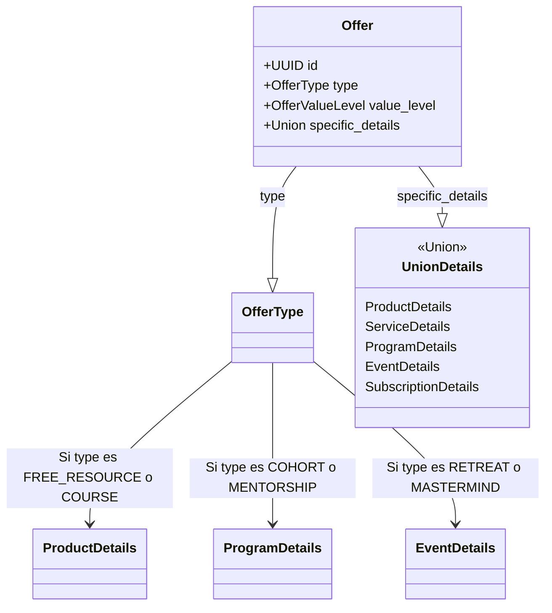

# Arquitectura Polimórfica de Ofertas (Offer Polymorphism)

Este documento define la estrategia técnica para manejar la variabilidad de datos en el sistema de Ofertas (`Offer`). Está diseñado para ser leído tanto por desarrolladores humanos como por Agentes de IA encargados de mantener y extender el código.

## 1. El Problema

En el dominio de ventas High Ticket, una "Oferta" puede ser cosas radicalmente distintas:
*   Un **Lead Magnet** (PDF) requiere: `url_descarga`, `formato_archivo`.
*   Un **Curso por Cohortes** requiere: `fecha_inicio`, `horario_sesiones`, `cupos_maximos`.
*   Un **Retiro de Lujo** requiere: `ubicacion`, `hospedaje_incluido`, `itinerario`.

Tratar de meter todos estos campos en una sola tabla plana (`Offer`) resultaría en una entidad con cientos de columnas vacías (NULL hell).

## 2. La Solución: Polimorfismo con Discriminador

Utilizamos el patrón **Discriminator Union** de Pydantic.
La entidad `Offer` se compone de:
1.  **Núcleo Común**: Campos que *toda* oferta tiene (`id`, `nombre`, `precio`, `promesa`).
2.  **Discriminador (`type`)**: El campo Enum `OfferType` que dicta qué "forma" tiene la oferta.
3.  **Detalles Específicos (`specific_details`)**: Un campo polimórfico que cambia de esquema (Clase) según el valor del discriminador.

### Diagrama Conceptual



## 3. Implementación Técnica

El código reside en `backend/src/core/domain/offer/schema.py`.

### 3.1. Mapa de Vinculación (`OFFER_TYPE_TO_DETAILS_MAPPING`)

Existe un diccionario constante que actúa como la "Fuente de Verdad" para la validación.

```python
OFFER_TYPE_TO_DETAILS_MAPPING = {
    OfferType.FREE_RESOURCE: ProductDetails,
    OfferType.COHORT_BASED_COURSE: ProgramDetails,
    # ...
}
```

### 3.2. Validación Estricta

El modelo `Offer` implementa un validador (`@model_validator`) que ejecuta la siguiente lógica en cada escritura:

1.  **Check de Consistencia**: Busca el `type` actual en el mapa.
2.  **Validación de Tipo**: Si el `type` requiere `ProgramDetails`, verifica `isinstance(specific_details, ProgramDetails)`.
3.  **Rechazo**: Si intentas guardar un `COHORT_BASED_COURSE` con datos de `ProductDetails` (ej: sin fecha de inicio), el sistema lanza un `ValueError` explicativo.

## 4. Guía para IA: Cómo Extender el Modelo

Si necesitas agregar un nuevo tipo de oferta o nuevos campos, sigue estrictamente estos pasos para no romper la consistencia.

### Caso A: Agregar un Nuevo Campo a un Tipo Existente

**Escenario**: Quieres agregar `dress_code` a los Retiros (`Luxury Retreat`).

1.  Localiza la clase `EventDetails` en `schema.py`.
2.  Agrega el campo con su tipo: `dress_code: Optional[str] = None`.
3.  No es necesario tocar el validador ni el mapa.

### Caso B: Crear un Nuevo Tipo de Oferta

**Escenario**: Quieres agregar `SOFTWARE_SAAS` como un nuevo tipo de oferta.

1.  **Paso 1: Enum**: Agrega `SOFTWARE_SAAS` al Enum `OfferType` en `offer_enums.py`.
2.  **Paso 2: Schema**: Define la nueva clase de detalles en `schema.py` (o reutiliza una existente si encaja).
    ```python
    class SaasDetails(BaseModel):
        api_limit: int
        seats_included: int
    ```
3.  **Paso 3: Union**: Agrega `SaasDetails` a la definición del campo `specific_details` en `Offer`.
    ```python
    specific_details: Optional[Union[..., SaasDetails]] = None
    ```
4.  **Paso 4: Mapping (CRÍTICO)**: Registra la vinculación en `OFFER_TYPE_TO_DETAILS_MAPPING`.
    ```python
    OFFER_TYPE_TO_DETAILS_MAPPING = {
        # ...
        OfferType.SOFTWARE_SAAS: SaasDetails
    }
    ```

### Caso C: Ajustar Reglas de Value Level

El sistema también valida que el `offer_value_level` (ej: N1, N2) coincida con el `OfferType`.

1.  Edita `OFFER_METADATA` en `backend/src/core/domain/offer_enums.py`.
2.  Asegúrate de que la clave `"level"` sea correcta para el tipo.
3.  El validador en `Offer` leerá esta configuración automáticamente.

## 5. Glosario de Clases de Detalle

*   **`ProductDetails`**: Productos digitales estáticos, descargas, cursos grabados (DIY).
*   **`ServiceDetails`**: Servicios 1:1, Agencias, Done-For-You (DFY).
*   **`ProgramDetails`**: Programas híbridos, Cohortes, Mentorías grupales (DWY).
*   **`SubscriptionDetails`**: Membresías recurrentes, Newsletters, Comunidades.
*   **`EventDetails`**: Eventos físicos o virtuales, Retiros, Masterminds.

---
**Nota para el Agente**: Antes de proponer código, lee siempre este archivo para asegurar que tu propuesta respeta la integridad polimórfica del sistema.
