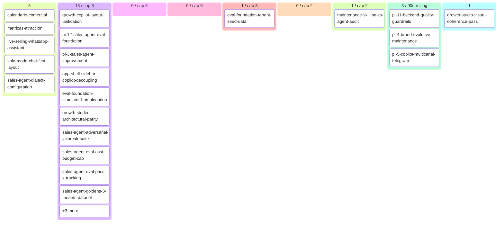

# Nicolify Backlog (auto-generated)

> Generated at: `2026-05-07T01:49:19+00:00`
> DO NOT EDIT MANUALLY — modify source artifacts.
> Regenerate: `python scripts/generate_backlog.py`

## 📊 Roadmap view (filtered + curated)

### 💡 Ideas (5)
- calendario-comercial `[idea]`
- metricas-atraccion `[idea]`
- live-selling-whatsapp-assistant `[idea]`
- solo-mode-chat-first-layout `[idea]`
- sales-agent-dialect-configuration `[story]`

### 🔬 Refining (13 total · 2 cap-eligible / cap 3)
- **growth-copilot-layout-unification**
- **pi-12-sales-agent-eval-foundation**
- **pi-3-sales-agent-improvement**
- **app-shell-sidebar-copilot-decoupling** — outcome `growth-copilot-layout-unification` [PM_DRAFT]
- **eval-foundation-simulator-homologation** — outcome `pi-12-sales-agent-eval-foundation` [PM_DRAFT]
- **growth-studio-architectural-parity** — outcome `growth-copilot-layout-unification` [PM_DRAFT]
- **sales-agent-adversarial-jailbreak-suite** — outcome `pi-12-sales-agent-eval-foundation` [PM_DRAFT]
- **sales-agent-eval-cost-budget-cap** — outcome `pi-12-sales-agent-eval-foundation` [PM_DRAFT]
- **sales-agent-eval-pass-k-tracking** — outcome `pi-12-sales-agent-eval-foundation` [PM_DRAFT]
- **sales-agent-goldens-3-tenants-dataset** — outcome `pi-12-sales-agent-eval-foundation` [PM_DRAFT_REFRAMED]
- **sales-agent-personas-instrumented-runtime** — outcome `pi-12-sales-agent-eval-foundation` [PM_DRAFT]
- **sales-agent-voice-fidelity-ci-gate** — outcome `pi-12-sales-agent-eval-foundation` [PM_DRAFT]
- **sales-agent-voice-fidelity-grader-runtime** — outcome `pi-12-sales-agent-eval-foundation` [PM_DRAFT]

### ✅ Refined — listo para arquitectos (0 / cap 5)
- _(none)_

### 📦 Ready for development (0 / cap 5)
- _(none)_

### 🔨 Developing (1 / cap 3)
- **eval-foundation-tenant-seed-data** — outcome `pi-12-sales-agent-eval-foundation` [BUILD_T1]

### 🧪 Developed — esperando QA (0 / cap 2)
- _(none)_

### 🔍 Reviewing (1 / cap 2)
- maintenance-skill-sales-agent-audit

### Recently shipped (last 90d, 3 items)
- pi-11-backend-quality-guardrails — 2026-05-06
- pi-4-brand-evolutive-maintenance — 2026-05-06
- pi-5-copilot-multicanal-telegram — 2026-05-06

### Parked (1) · Dropped (2)
- 🅿 growth-studio-visual-coherence-pass
- ❌ ~~pi-10-growth-studio-ux-homologation~~
- ❌ ~~pi-9-growth-studio-architecture~~

---

## 🔄 Operational view (Mermaid kanban)

---

## 📈 Capabilities snapshot

| module | live | in-progress | planned | deprecated | total |
|---|---|---|---|---|---|
| advertising | 3 | 0 | 0 | 0 | 3 |
| analytics | 4 | 0 | 0 | 0 | 4 |
| assets | 3 | 1 | 0 | 0 | 4 |
| brand | 5 | 0 | 0 | 0 | 5 |
| campaigns | 4 | 0 | 0 | 0 | 4 |
| commercial-calendar | 1 | 0 | 0 | 0 | 1 |
| connections | 3 | 1 | 0 | 0 | 4 |
| copilot | 4 | 0 | 0 | 0 | 4 |
| crm | 2 | 0 | 0 | 0 | 2 |
| iam | 2 | 0 | 0 | 0 | 2 |
| landing | 3 | 0 | 0 | 0 | 3 |
| offer | 5 | 0 | 0 | 0 | 5 |
| sales-agent | 4 | 1 | 0 | 0 | 5 |
| scheduling | 3 | 0 | 0 | 0 | 3 |
| social-media | 2 | 0 | 0 | 0 | 2 |
| tenant-domains | 1 | 0 | 0 | 0 | 1 |
| **TOTAL** | **49** | **3** | **0** | **0** | **52** |

