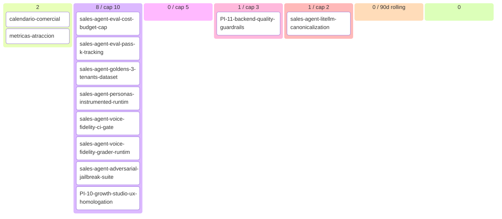

# Nicolify Backlog (auto-generated)

> Generated at: `2026-05-06T04:33:22+00:00`
> DO NOT EDIT MANUALLY — modify source artifacts.
> Regenerate: `python scripts/generate_backlog.py`

## 📊 Roadmap view (filtered + curated)

### Now (state=building, 1 items)
- **PI-11-backend-quality-guardrails**

### Next (state=ready, 0 items)
- _(none)_

### Validated (worth solving, 8 items)
- sales-agent-eval-cost-budget-cap `[story]`
- sales-agent-eval-pass-k-tracking `[story]`
- sales-agent-goldens-3-tenants-dataset `[story]`
- sales-agent-personas-instrumented-runtime `[story]`
- sales-agent-voice-fidelity-ci-gate `[story]`
- sales-agent-voice-fidelity-grader-runtime `[story]`
- sales-agent-adversarial-jailbreak-suite `[story]`
- PI-10-growth-studio-ux-homologation `[legacy-pi]`

### Done (review state queue, 1 items)
- sales-agent-litellm-canonicalization

### Recently shipped (last 90d, 0 items)
- _(none recent)_

### Parked (0) · Dropped (0)

---

## 🔄 Operational view (Mermaid kanban)

---

## 📈 Capabilities snapshot

| module | live | in-progress | planned | deprecated | total |
|---|---|---|---|---|---|
| advertising | 3 | 0 | 0 | 0 | 3 |
| analytics | 4 | 0 | 0 | 0 | 4 |
| assets | 3 | 1 | 0 | 0 | 4 |
| brand | 5 | 0 | 0 | 0 | 5 |
| campaigns | 4 | 0 | 0 | 0 | 4 |
| commercial-calendar | 1 | 0 | 0 | 0 | 1 |
| connections | 3 | 1 | 0 | 0 | 4 |
| copilot | 4 | 0 | 0 | 0 | 4 |
| crm | 2 | 0 | 0 | 0 | 2 |
| iam | 2 | 0 | 0 | 0 | 2 |
| landing | 3 | 0 | 0 | 0 | 3 |
| offer | 5 | 0 | 0 | 0 | 5 |
| sales-agent | 3 | 2 | 0 | 0 | 5 |
| scheduling | 3 | 0 | 0 | 0 | 3 |
| social-media | 2 | 0 | 0 | 0 | 2 |
| tenant-domains | 1 | 0 | 0 | 0 | 1 |
| **TOTAL** | **48** | **4** | **0** | **0** | **52** |

